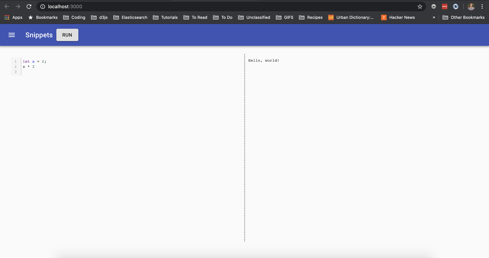
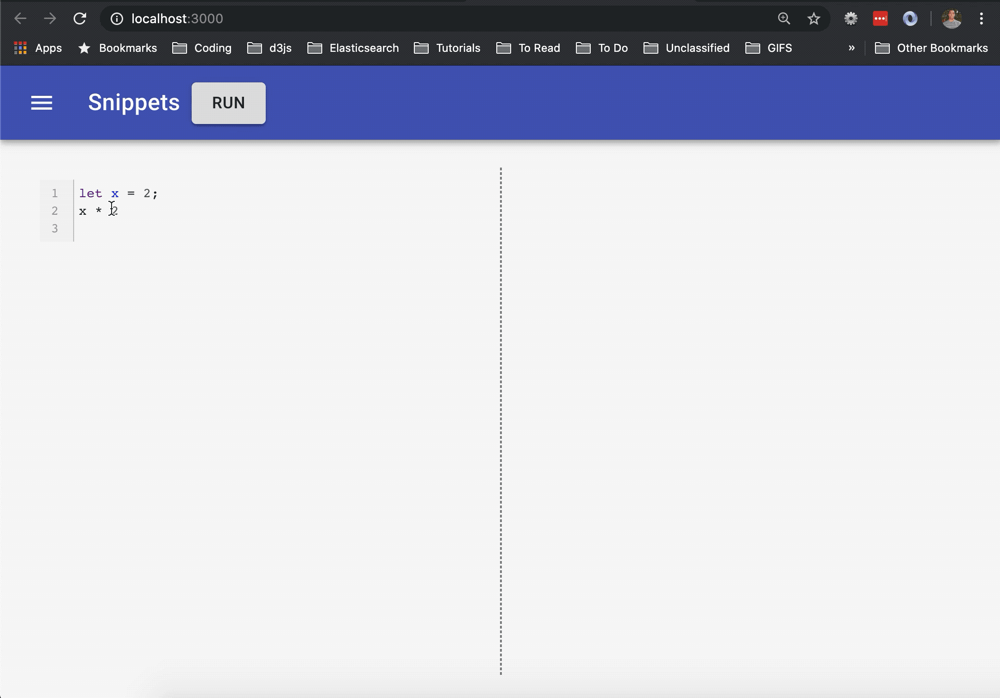

# Snippet UI Take Home Assignment



## Overview

The Snippet UI consists of an input and output area. The input area contains a code editor which accepts javascript code. The output area needs to display the result of the evaluated code in the code editor, e.g. see below. The goal of this activity is to hook up the `Run` button so that the results of the evaluated code appear in the output area.



Feel free to style and modify the results and/or UI as you see fit. If you have extra time and want to go further, you could try your hand at hooking up the snippet history feature. The task is to display a list of the previously run snippets the side drawer, e.g. see image below. This is a little bit more involved and requires examining the code in the `server` to determine which GraphQL queries are available and making them available on the frontend utilizing [Apollo Client](). Then you'll want to extend the `src` code to display the snippets.


## Getting Started

### Prerequisites

1. [Node](https://nodejs.org/en/)
2. [Yarn](https://yarnpkg.com/getting-started/install)

### Install dependencies

In the project directory, you can run:

```
$ yarn && yarn start
```

## References

- [React](https://reactjs.org/)
- [Apollo](https://www.apollographql.com/docs/react/)
- [GraphQL](https://graphql.org/)
- [MaterialUI](https://material-ui.com/)
- [Styled Components](https://styled-components.com/docs/basics)
- [Typescript](https://www.typescriptlang.org/)

This project was bootstrapped with [Create React App](https://github.com/facebook/create-react-app).

## Learn More

You can learn more in the [Create React App documentation](https://facebook.github.io/create-react-app/docs/getting-started).

To learn React, check out the [React documentation](https://reactjs.org/).
